>------------<
- タイトル:[【1】Laravelでコーディングテストサービスを共同開発した際のメモ【環境構築編】 ]
- WordPressにアップロードしますか？:y[x]はいn[]まだしない
- 投稿時:p[x]公開d[]下書き
- カスタムURL:[joint-development-Laravel-coding-tester-1]
- カテゴリID:[12,15,16]
- タグID:[]
- 見出し画像のID:[]
- 識別番号[HSEo7AEIMiDo]
>------------<

<!-- ↓続き
[kanren id=""] -->

こんにちは！かたつむり([@Katatumuri_nyan](https://twitter.com/Katatumuri_nyan))です！

今回は、[とらちゃん](https://github.com/dt-torachan)と共同開発した際の開発メモを書いていきます！
コーディングの試験を登録できるサービスを作成しています。

[GitHub](https://github.com/dt-torachan)/CodingTester)でソースコードを管理しています！

**最初から見る↓**
[kanren id="723"]

<!-- **前回を見る↓**
[kanren id=""] -->

## リポジトリのクローン
とらちゃんのリポジトリがメインなので、そちらにGitHubから招待してもらいます。
（メモ：Forkすると複雑になるの）

[GitHub](https://github.com/dt-torachan/CodingTester)から、クローンして、`feature/design`ブランチを切りました。

参考:[githubを使った共同作業の手順](https://qiita.com/future_kame/items/9fa256aea09faa28b357)

## dockerのコンテナを立てる
今回はdockerで環境構築をするので、`docker-compose up -d --build`
（すでにとらちゃんがdocker-composeファイルなどは作ってくれています。）

## `index.php`が開けない
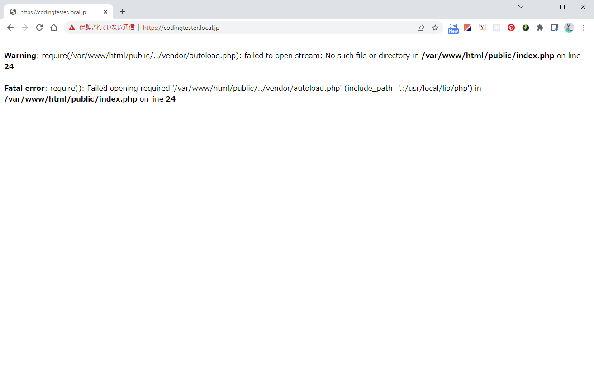  

コンテナ内で`composer install`します。

参考:[Laravelで…vendor/autoload.php): failed to open stream: No such file or directory というエラーによりデフォルト画面が表示されない解決方法](https://qiita.com/pugiemonn/items/3d000ac0486987dd92df)

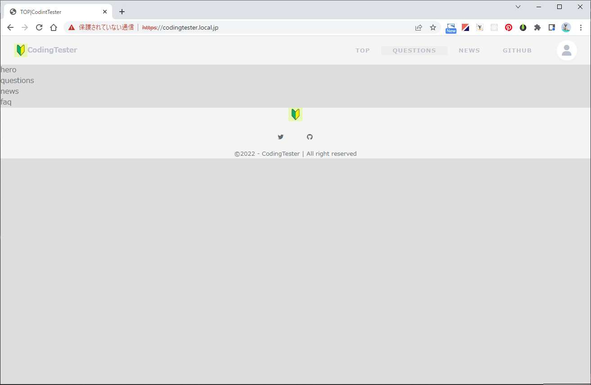  
表示されました！

中身はちょっと作ってあるのと、私もデザインを少しいじっているので、続きからやっていきます。

## データベースとの接続
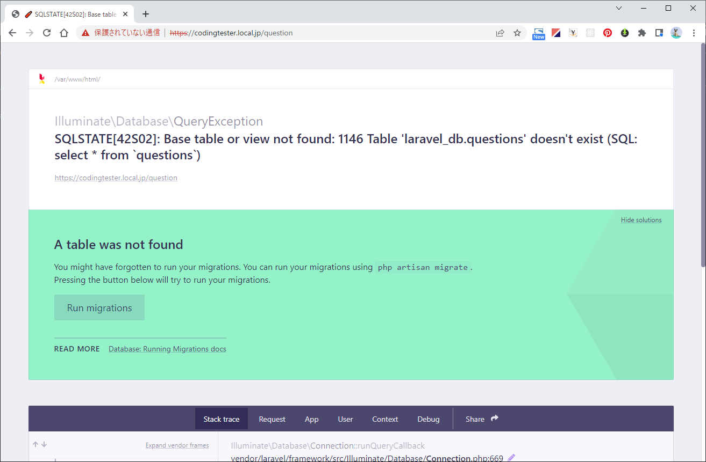  
> SQLSTATE[42S02]: Base table or view not found: 1146 Table 'laravel_db.questions' doesn't exist (SQL: select * from `questions`)
> A table was not found
> You might have forgotten to run your migrations. You can run your migrations using php artisan migrate.
> Pressing the button below will try to run your migrations.

データベースと接続できないので、解決方法をメモします。

### appコンテナ内で`php artisan migrate`してみる
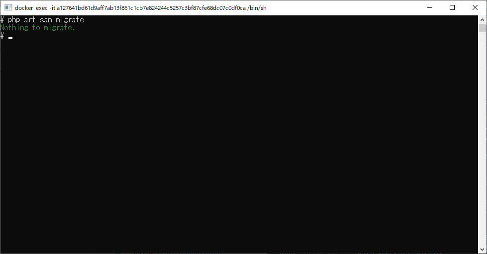  
`Nothing to migrate.`

### キャッシュクリアしてみる
`php artisan cache:clear`
`php artisan config:clear`
`php artisan migrate:refresh`

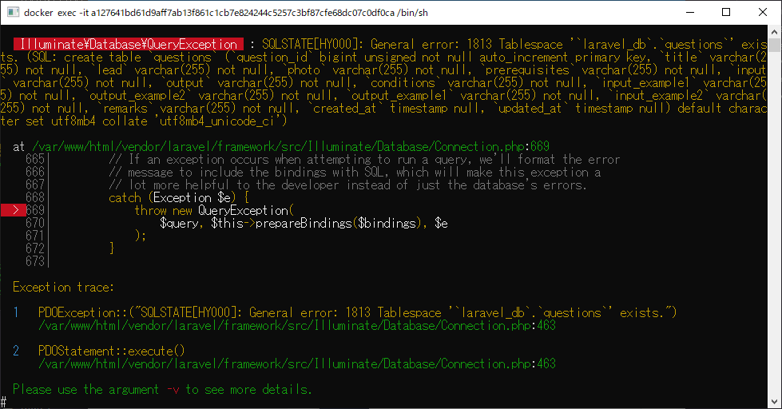  
> PDOException::("SQLSTATE[HY000]: General error: 1813 Tablespace '`laravel_db`.`questions`' exists.")

  
ちなみにテーブルはありません

### DBコンテナを削除してみる
DBコンテナに問題があるかもしれないので、DBコンテナだけ再ビルドします。
dockerデスクトップでdbコンテナ停止・dbコンテナremove
`docker-compose up -d --build db`

もう一度
`php artisan migrate`します。

同エラーが出たのでもう一度キャッシュクリアします。
`php artisan cache:clear`
`php artisan config:clear`
`php artisan migrate:refresh`

同エラーが出ます。

### コンテナを一度削除して作成しなおす。
`docker-compose down`
`docker-compose up -d --build`
`php artisan migrate`

同エラーが出ました

### パーミッションを確認する
一応パーミッションを確認してみます。
dbのコンテナで確認します。
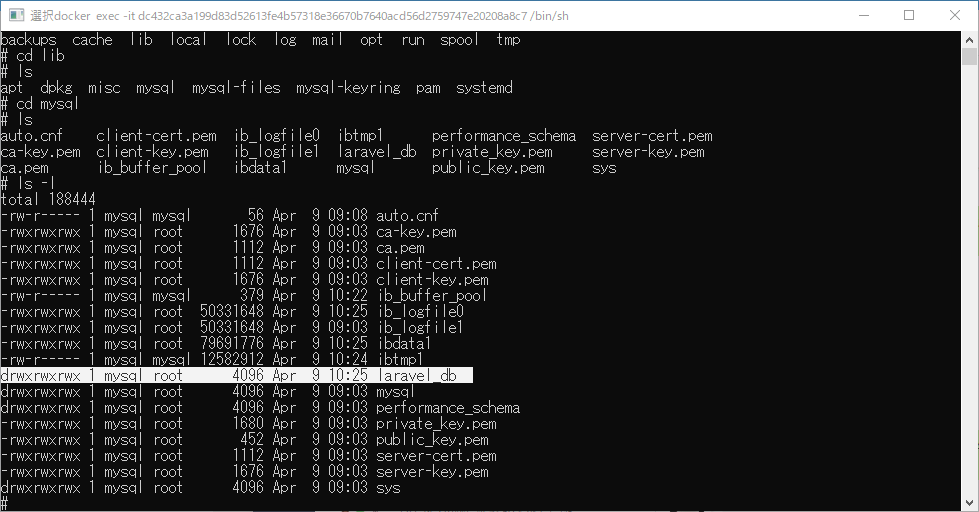  
大丈夫そうですね。なんでだろうｗ

### データベースを削除
`rm -rf laravel_db`
`mkdir laravel_db`
`php artisan migrate`

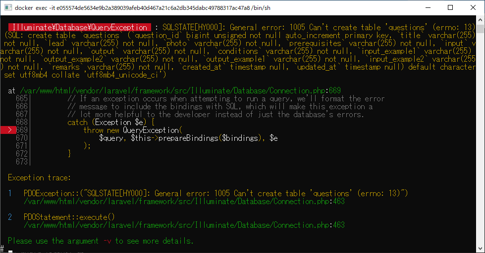  
パーミッションエラーが出たので、パーミッション変更します。

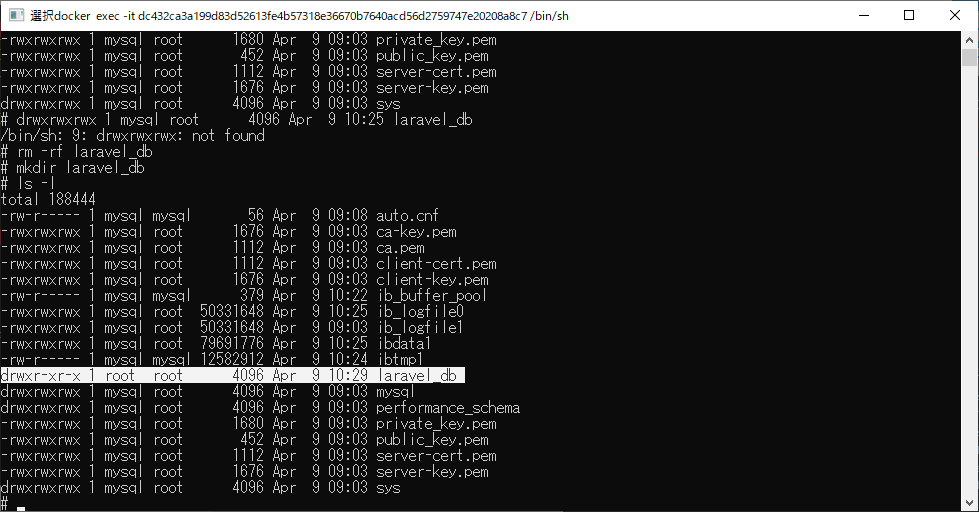  
確認して

↓
`chmod 777 laravel_db`
`ls -l`
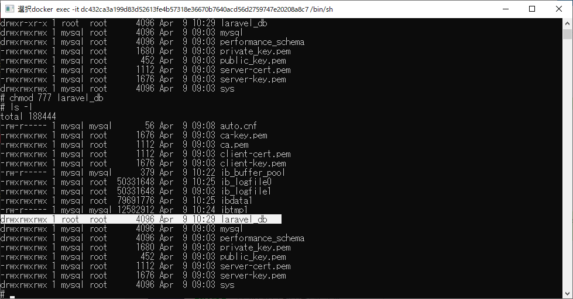  
変更できました。

再び`php artisan migrate`
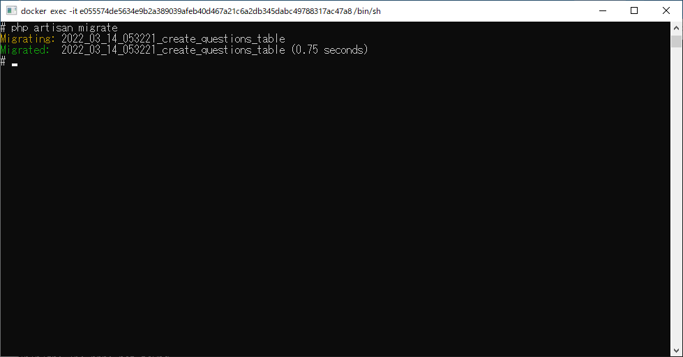  
できたっぽい

## データの生成
すでに問題データがあるので、`php artisan db:seed`しときます。
[Laravelでシーダーを使う](https://qiita.com/shosho/items/b69db263a494edfe3b21)

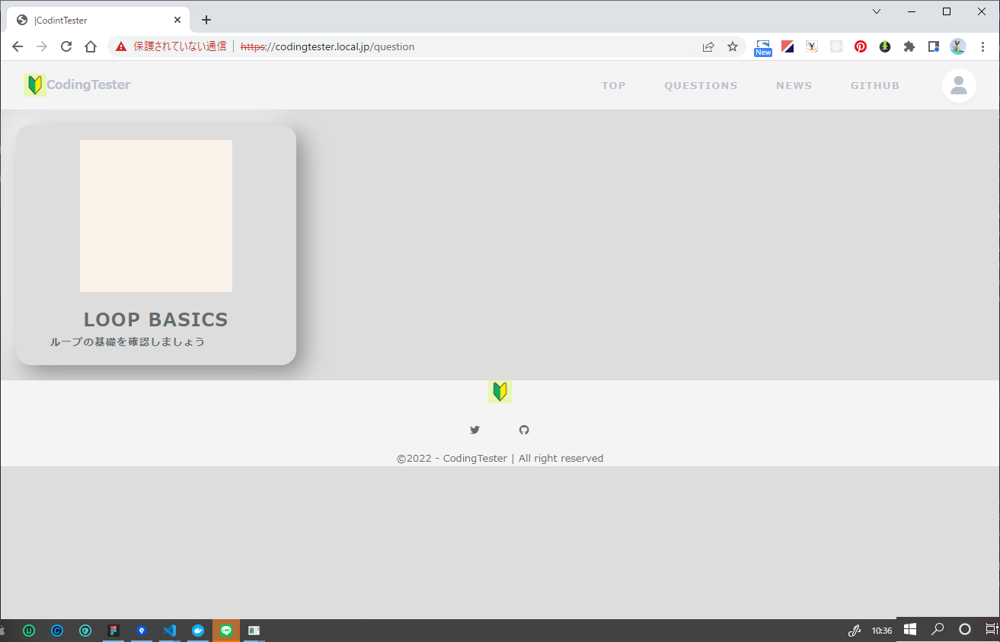  

これで環境構築は終了です(*´ω｀)