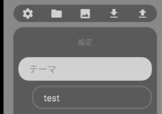
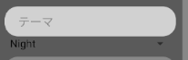
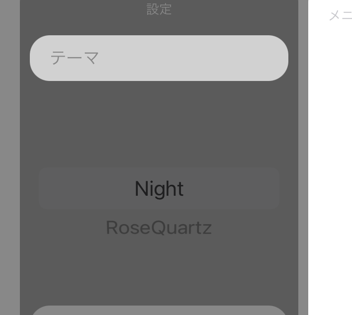
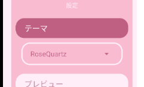
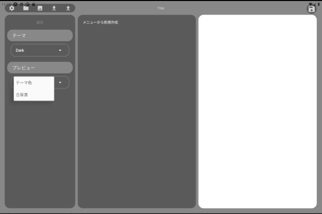

>------------<
- タイトル:[【13】React Nativeでテキストエディタを作ってみる！【テーマ機能の実装】]
- WordPressにアップロードしますか？:y[x]はいn[]まだしない
- 投稿時:p[x]公開d[]下書き
- カスタムURL:[React-Native-challenge-to-create-text-editor-13]
- カテゴリID:[3,11,12]
- タグID:[]
- 見出し画像のID:[]
- 識別番号[YeKTPc1vpZQR]
>------------<


こんにちは！かたつむり([@Katatumuri_nyan](https://twitter.com/Katatumuri_nyan))です！

Reactを触ってみて、サイト的なものは作れるようになりました(*´ω｀)
そこで、次はReactNativeを触ってみようと思い、簡単なテキストエディタを作成しようと企んでおります(笑)

ここまでで、ファイルの読み書きやデザインなどはだいたいできてきたので、機能を追加していきます！
今回は、アプリの色を変更できるテーマ機能を実装していきます。

[第9回目の「App.jsの作成」](https://katatumuri.xyz/react/628/react-native-challenge-to-create-text-editor-9/#Appjs%E3%81%AE%E4%BD%9C%E6%88%90)あたりで、テーマ機能の追加・設定をすでにしています。
今回は、各テーマのカラーを`theme.js`に追加していくのと、ユーザーがテーマを選べるようにしていきます！

[GitHub](https://github.com/katatumuri-maimai/snail_Markdown_TextEditor)でソースコードを管理しています！

**最初から見る↓**
[kanren id="557"]

**前回を見る↓**
[kanren id="644"]

## 出来上がりのデモ
<blockquote class="twitter-tweet"><p lang="ja" dir="ltr">テーマ変更機能できました😊<br>もうちょっとテーマ追加していきます。 <a href="https://t.co/cPpnBOuHLw">pic.twitter.com/cPpnBOuHLw</a></p>&mdash; Katatumuri (@Katatumuri_nyan) <a href="https://twitter.com/Katatumuri_nyan/status/1413459227419365378?ref_src=twsrc%5Etfw">July 9, 2021</a></blockquote> <script async src="https://platform.twitter.com/widgets.js" charset="utf-8"></script>
↑テーマ機能の完成版ははこんな感じです！

## ユーザーがテーマを選べるようにする
  

まずは、↑このようにユーザーがテーマを選べるようにします。
テーマ情報は`snailSetting.json`に保存しているので、ここにユーザーが選んだテーマを上書きしていきます。


### テーマ選択のためのピッカーの導入
テーマが複数あるので、テーマリストの中から選んでもらうために、ピッカーを導入します。
[react-native-picker/picker](https://github.com/react-native-picker/picker)からインストールしていきます！
`npm install @react-native-picker/picker --save --legacy-peer-deps`

```javascript
export const themeList=[
    'Night',
    'RoseQuartz'
]
```
`theme.js`にて`themeList`を作成しておきました。

これを`Setting,js`にインポートして使用していきます。

テーマ管理を簡単にするため、テーマリストはテーマの中で管理します。


```javascript
<Picker
    selectedValue={selectedTheme}
    onValueChange={(itemValue, itemIndex) =>
        setSelectedTheme(itemValue)
    }>
    {themeList.map(e=>{
        return(
            <Picker.Item key={e} label={e} value={e} />
        )
    })}
    
</Picker>
```
↑このように、`Setting.js`にピッカーを導入しました。

  
Android↑
iPad↓
  

↑こんな感じで表示されました！

```javascript
const [appTheme, setAppTheme] = useState("Night")
```
↑既に作成しているこのステートを更新することで、テーマを変更できるようになりました。

<blockquote class="twitter-tweet"><p lang="ja" dir="ltr">テーマ更新🥰 <a href="https://t.co/ZYbuz6STnP">pic.twitter.com/ZYbuz6STnP</a></p>&mdash; Katatumuri (@Katatumuri_nyan) <a href="https://twitter.com/Katatumuri_nyan/status/1413376361981366275?ref_src=twsrc%5Etfw">July 9, 2021</a></blockquote> <script async src="https://platform.twitter.com/widgets.js" charset="utf-8"></script>
↑デモ動画

### ピッカーのデザイン変更
ピッカーのデザインを変更していきます。
思ってたよりAndroidとiPadでピッカーが違いすぎるので、適度にやっていきます！

  
↑Android
iPad↓
  

スタイルの適応範囲が制限されているみたいだったので、このくらいにしておきました。


### 選んだテーマを保存する
テーマを選ぶだけだと、アプリを閉じたらテーマが保存されないので、テーマを保存していきます。
`readSetting.js`で書き込みの設定をします！

```javascript
export async function setThemeSetting(themeName) {
    const settingData = await FS.readAsStringAsync(fileUri, { encoding: FileSystem.EncodingType.UTF8 })
        .then(e => {
            return e
        }).catch(err => {
            console.error("setThemeSetting>>readAsStringAsync >>" + err);
        })

    let new_settingData_json = await JSON.parse(settingData)
    new_settingData_json["theme"] = themeName
    
  
    await FS.writeAsStringAsync(fileUri, JSON.stringify(new_settingData_json), { encoding: FileSystem.EncodingType.UTF8 })
        .then(e => {
            return e
        }).catch(err => {
            console.log(fileUri);
            console.error("setThemeSetting>>writeAsStringAsync >>" + err);
        })

    return JSON.parse(settingData)
}
```
↑こんな感じでテーマ情報を上書きすることができました。


## テーマの色を拾っていく。
  

↑これだけテーマを作ったので、色を`theme.js`に追加していきます。


## プレビュー画面の色設定   
右側のプレビュー画面の色を、テーマカラーと一緒にするか、白黒にするか選べるようにします。

その設定も設定ファイルに保存しておきます！

  

↑このように、選べるようにしました。

コードはテーマ選択の時と変わらないので省略します。


次はファイルのインポート・エクスポートをしていきます！

↓続き
[kanren id="650"]