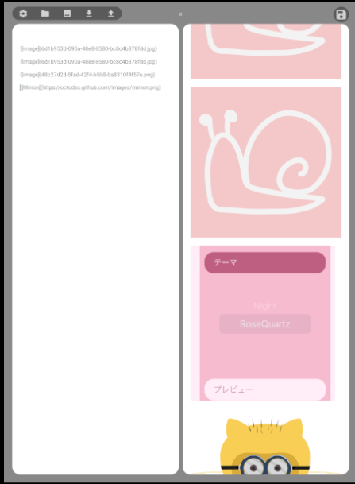

>------------<
- タイトル:[【17】React Nativeでテキストエディタを作ってみる！【細かい修正編】]
- WordPressにアップロードしますか？:y[x]はいn[]まだしない
- 投稿時:p[x]公開d[]下書き
- カスタムURL:[React-Native-challenge-to-create-text-editor-17]
- カテゴリID:[3,11,12]
- タグID:[]
- 見出し画像のID:[]
- 識別番号[aH1inE3QlBS9]
>------------<


こんにちは！かたつむり([@Katatumuri_nyan](https://twitter.com/Katatumuri_nyan))です！

Reactを触ってみて、サイト的なものは作れるようになりました(*´ω｀)
そこで、次はReactNativeを触ってみようと思い、簡単なテキストエディタを作成しようと企んでおります(笑)

もうそろそろアプリとして配信できるくらいになってきた！
いま見つかっている細かいバグや、もう少し改良したい点などを修正していきます😊

[GitHub](https://github.com/katatumuri-maimai/snail_Markdown_TextEditor)でソースコードを管理しています！

**最初から見る↓**
[kanren id="557"]

**前回を見る↓**
[kanren id="656"]


## 修正したいところ

1. PDF出力時に画像があると反映されない
2. プレビュー画面の一番下が見切れてしまう
3. プレビュー画面のスクロール位置が入力のたびにトップに戻ってしまう


## 1. PDF出力時に画像があると反映されない
  

↑左ように入力すると、右のようにプレビューされます。
しかし、PDF出力結果は↓です。

  

PDF出力に試用している`Print`ライブラリの仕様で、PDFに出力する際に、ローカルの画像はbase64に変換する必要があります。

base64に変換するのは大変なので、ローカルのファイルはbase64で再読み込みすることにしました。


```javascript
async function convertImage(html) {
    // imgタグの取得
    const imageTag = /( {
            const imageSrc = imageTag.replace(/ {
            needReaplace_imageSrcList =
                needReaplace_imageSrcList
                    .filter(../../imagesrc => { return filterByImageHandler(../../imagesrc, imageHandler) })
        })


        // base64に置換が必要なsrcリストをbase64に変換

        for (const imageSrc of needReaplace_imageSrcList) {
            let before_imageSrc = imageSrc
            let imageUri = imagePickerUri + imageSrc
            let after_imageSrc = ''

            needAddHeaderImageHandlers.forEach(imageHandler => {
                const matchData = imageSrc.match(imageHandler)
                if (!!matchData) {
                    imageUri = localDefaltImageHandler + { ...matchData }.input
                }
            })

            const matchData = imageSrc.match(localDefaltImageHandler)
            if (!!matchData) {
                imageUri = { ...matchData }.input
            }

            const ext = imageUri.match(/.*\.(.*$)/)[1].toLowerCase()
            const fileType = ext == 'jpeg' ? 'jpg' : ext

            after_imageSrc =
                `data:image/${fileType};base64,` +
                await FileSystem.readAsStringAsync(imageUri, { encoding: FileSystem.EncodingType.Base64 })

            html = html.replace(before_imageSrc, after_imageSrc)

        }
        
        const imgStyle = `{
  return <Markdown>{e}</Markdown>
})}
```
↑このように、`Markdown`に挿入するテキストを配列にすることで、すでに読み込まれている`Markdown`が更新されるのを防ぎました。


今回はこのあたりで終わりにします！
あとは、細かい修正を沢山していくことになると思います。

なので、ここで一旦「React Nativeでテキストエディタを作ってみる！」シリーズの開発編は終了です。
次回以降の記事では、アプリの公開申請と、成果のまとめをしていきます😊

大きめの修正や重要な修正などがありましたら、別途記事にするかもです！


それでは！

↓続き
[kanren id=""]