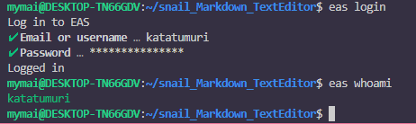
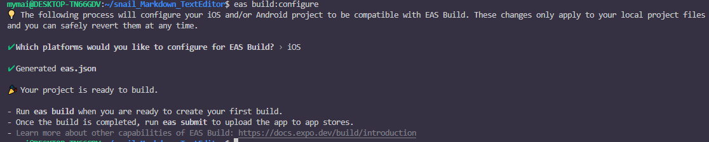
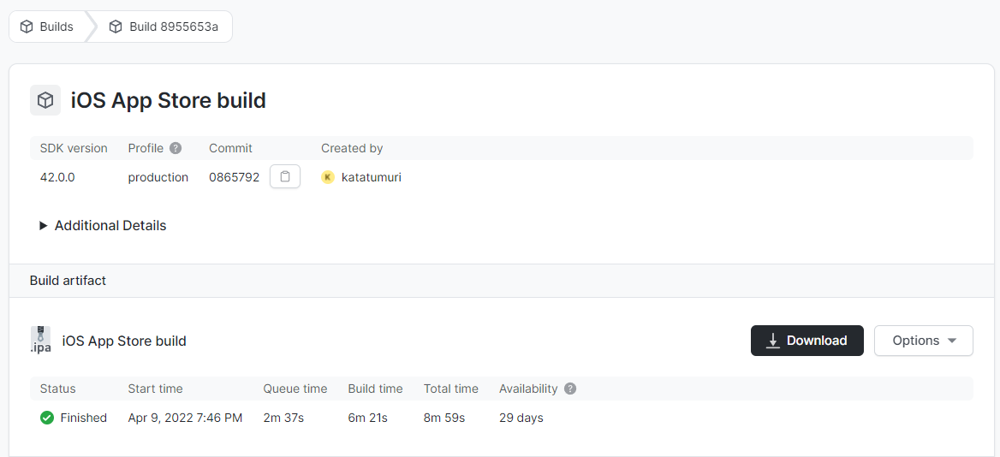
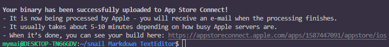

>------------<
- タイトル:[【20】React Nativeでテキストエディタを作ってみる！【EAS CLIでデプロイ編】]
- WordPressにアップロードしますか？:y[x]はいn[]まだしない
- 投稿時:p[x]公開d[]下書き
- カスタムURL:[React-Native-challenge-to-create-text-editor-20]
- カテゴリID:[3,11,12]
- タグID:[]
- 見出し画像のID:[]
- 識別番号[WrvOYZrBRd7U]
>------------<

<!-- ↓続き
[kanren id=""] -->

こんにちは！かたつむり([@Katatumuri_nyan](https://twitter.com/Katatumuri_nyan))です！

Reactを触ってみて、サイト的なものは作れるようになりました(*´ω｀)
そこで、次はReactNativeを触ってみようと思い、簡単なテキストエディタを作成しようと企んでおります(笑)

macを借りて公開するのがめんどくさすぎるので、EAS CLIを使って公開していきます。

[GitHub](https://github.com/katatumuri-maimai/snail_Markdown_TextEditor)でソースコードを管理しています！

**最初から見る↓**
[kanren id="557"]

**前回を見る↓**
[kanren id="716"]

[公式ドキュメント](https://docs.expo.dev/build/setup/)を見ながら作業していきます。

## 最新のEASCLIをインストール
`npm install -g eas-cli`

## Expoアカウントにログイン
`eas login`
EXPOのアカウントでログインします。

`eas whoami`でログインで来てるか確認

  

できました。

## プロジェクトを構成
`eas build:configure`

  

## ビルドを実行
`eas build --platform ios`
appleのアカウントにログインするとビルドが始まります

  
ビルドできました

## 送信を開始
`eas submit -p ios`

  

送信できました！

このまま申請出します。
→受かりました！