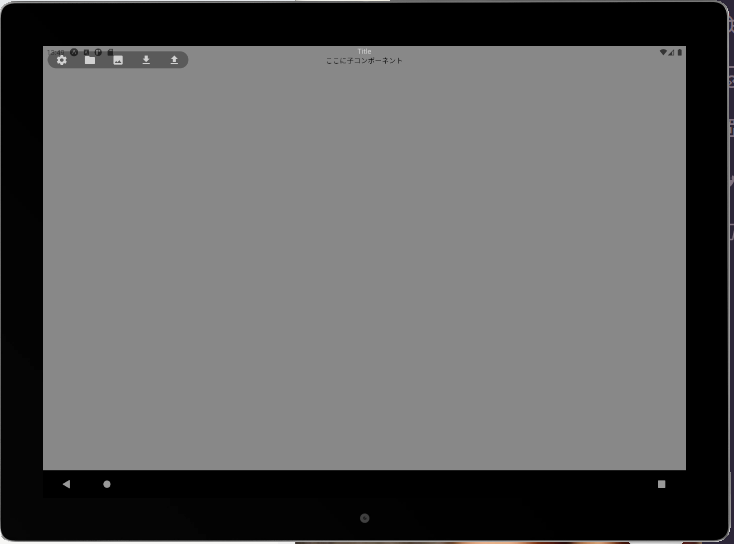
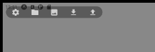

>------------<
- タイトル:[【10】React Nativeでテキストエディタを作ってみる！【ナビ・エディタエリア作成編】]
- WordPressにアップロードしますか？:y[]はいn[x]まだしない
- 投稿時:p[]公開d[x]下書き
- カスタムURL:[React-Native-challenge-to-create-text-editor-10]
- カテゴリID:[3,11,12]
- タグID:[]
- 見出し画像のID:[]
- 識別番号[]
>------------<

<!-- ↓続き
[kanren id=""] -->

こんにちは！かたつむり([@Katatumuri_nyan](https://twitter.com/Katatumuri_nyan))です！

Reactを触ってみて、サイト的なものは作れるようになりました(*´ω｀)
そこで、次はReactNativeを触ってみようと思い、簡単なテキストエディタを作成しようと企んでおります(笑)

今回は、ナビとエディタエリアを作成していきます(*´ω｀)


[GitHub]()でソースコードを管理しています！

**最初から見る↓**
[kanren id="557"]

**前回を見る↓**
[kanren id="628"]


## 前回までのできたところ
  
ここまでできました～！

- App.js
- TopBar.js
- Title.js
- Nav.js
- その他関数等のファイル

↑を作成ました。

↓が目標なので、がんばります！
  


## ナビの編集
  

`Nav.js`を編集していきます！
右から左にスワイプで閉じるようにしたいです～！(*´ω｀)

[React Native Gesture Handler](https://docs.swmansion.com/react-native-gesture-handler/)を使っていきます。

公式ドキュメントが分かり難いので、[React Native Gesture Handler: Swipe, long-press, and more](https://blog.logrocket.com/react-native-gesture-handler-swipe-long-press-and-more/)こちらを参考にしました。

### サンプル作成
↓とりあえずテストを作りました

<blockquote class="twitter-tweet"><p lang="ja" dir="ltr">スワイプテスト✨ <a href="https://t.co/XGvIpOT4Sz">pic.twitter.com/XGvIpOT4Sz</a></p>&mdash; Katatumuri (@Katatumuri_nyan) <a href="https://twitter.com/Katatumuri_nyan/status/1412569760793915395?ref_src=twsrc%5Etfw">July 7, 2021</a></blockquote> <script async src="https://platform.twitter.com/widgets.js" charset="utf-8"></script>

↓コードはコチラ
```javascript
import React from 'react';
import { Text, View, SafeAreaView} from 'react-native';
import { useTheme } from 'react-native-elements';
import Nav from './_components/Nav/Nav';
import Title from './_components/Title';
import Swipeable from 'react-native-gesture-handler/Swipeable';


export default function TopBar(props) {
    const { theme } = useTheme();

    const style ={
        position: 'relative',
        width: '100%',
        justifyContent:'center',
        alignItems: 'center',
    }

    const LeftSwipeActions =()=>{
        return(
            <View
                style={{
                    paddingHorizontal: 30,
                    paddingVertical: 20,
                    backgroundColor: 'red',
                }}
            >
                <Text style={{ fontSize: 24 }} style={{ fontSize: 20 }}>
                    LeftSwipeActions
                </Text>
            </View>
        )
    }

    const rightSwipeActions = () => {
        return (
            <View
                style={{
                    paddingHorizontal: 30,
                    paddingVertical: 20,
                    backgroundColor: 'pink',
                }}
            >
                <Text style={{ fontSize: 24 }} style={{ fontSize: 20 }}>
                    rightSwipeActions
                </Text>
            </View>
        )

    }

    const swipeFromRightOpen = () => {
        alert('Swipe from right');
    }

    const swipeFromLeftOpen = () => {
        alert('Swipe from left');
    }

    return(
        <SafeAreaView style={style}>
            <Nav/>
            <Title title={props.title}/>


            <Swipeable
                renderLeftActions={LeftSwipeActions}
                renderRightActions={rightSwipeActions}
                onSwipeableRightOpen={swipeFromRightOpen}
                onSwipeableLeftOpen={swipeFromLeftOpen}
            >
                <View
                    style={{
                        paddingHorizontal: 30,
                        paddingVertical: 20,
                        backgroundColor: 'white',
                    }}
                >
                    <Text style={{ fontSize: 24 }} style={{ fontSize: 20 }}>
                        text
                    </Text>
                </View>
            </Swipeable>


        </SafeAreaView>
    )
}
```

### スワイプ開閉するナビ完成
<blockquote class="twitter-tweet"><p lang="ja" dir="ltr">スワイプでナビの開閉できました✨ <a href="https://t.co/HO7FSgFNTk">pic.twitter.com/HO7FSgFNTk</a></p>&mdash; Katatumuri (@Katatumuri_nyan) <a href="https://twitter.com/Katatumuri_nyan/status/1412618601706639366?ref_src=twsrc%5Etfw">July 7, 2021</a></blockquote> <script async src="https://platform.twitter.com/widgets.js" charset="utf-8"></script>

最終的にこのようになりました(*´ω｀)
`Swipeable`ではなく、`PanGestureHandler`をつかいました～！

できたコードは↓こちら
```javascript
// Nav.js
import { PanGestureHandler} from 'react-native-gesture-handler';
export default function Nav(props) {
  const [isNavOpen, setIsNavOpen] = useState(false)
  let { theme } = useTheme();

  function onNavOpen() {
    setIsNavOpen(true)
  }

  function onNavClose() {
    console.log("swipe");
    setIsNavOpen(false)
  }

  function onSwipeEvent(event){
    const swipeX = event.nativeEvent.translationX

    if (swipeX <= 34) {
      onNavClose()
    } else if (34 < swipeX) {
      onNavOpen()
    }
  }

  const styles = {
    navContainer: {
      position: 'absolute',
      left: 10,
      top: 10,
      backgroundColor: 'pink',
      backgroundColor: theme.main.secondBackgroundColor,
      borderRadius: 20
    }
  }
  
    return (
      <PanGestureHandler onGestureEvent={(event) => { onSwipeEvent(event) }}>
        <View style={styles.navContainer}>
          {isNavOpen?
          <NavOpened color={theme.nav.iconColor} />:
          <NavClosed color={theme.nav.iconColor} onPress={onNavOpen} />
          }
        </View >
      </PanGestureHandler>
    )
}

```

```javascript

```


```javascript

```


```javascript

```

```javascript

```

```javascript

```

```javascript

```
```javascript

```