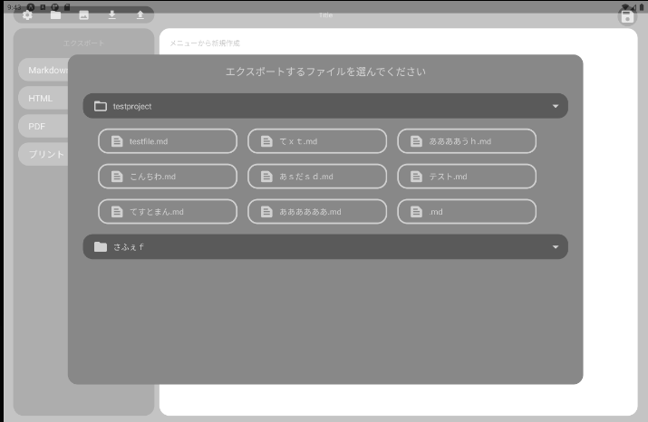

>------------<
- タイトル:[【14】React Nativeでテキストエディタを作ってみる！【インポート・エクスポート編】]
- WordPressにアップロードしますか？:y[x]はいn[]まだしない
- 投稿時:p[x]公開d[]下書き
- カスタムURL:[React-Native-challenge-to-create-text-editor-14]
- カテゴリID:[3,11,12]
- タグID:[]
- 見出し画像のID:[]
- 識別番号[In9Hx2NKUHln]
>------------<

<!-- ↓続き
[kanren id=""] -->

こんにちは！かたつむり([@Katatumuri_nyan](https://twitter.com/Katatumuri_nyan))です！

Reactを触ってみて、サイト的なものは作れるようになりました(*´ω｀)
そこで、次はReactNativeを触ってみようと思い、簡単なテキストエディタを作成しようと企んでおります(笑)

前回でテーマ機能の実装ができたので、今回はファイルのインポート・エクスポートをしていきます。
インポートしたファイルをアプリ内に保存するのと、ファイルをアプリ外に共有できるようにします。

また、バックアップもできるようにしていきます！

[GitHub](https://github.com/katatumuri-maimai/snail_Markdown_TextEditor)でソースコードを管理しています！

**最初から見る↓**
[kanren id="557"]

**前回を見る↓**
[kanren id="646"]


## ファイルのインポート
マークダウンファイルとテキストファイルは何もしなくてもインポートできるはずなので、やっていきます！

ファイルは、ユーザーが作成したプロジェクトフォルダに保存できるようにします。

`importExportFile.js`というファイルを作って、そこでインポート・エクスポート機能を設定していきます！

`expo install expo-document-picker`しておきます。

`SelectProjectModal`保存先のプロジェクトフォルダ選択用に使います。

```javascript
export async function importFile() {
    const data = await DocumentPicker.getDocumentAsync()
    const state = data.type

    if (state == "success") {
        const filename = data.name
        const fileUri = data.uri

        const filecontent = await FileSystem.readAsStringAsync(fileUri, { encoding: FileSystem.EncodingType.UTF8 })
            .then(e => {
                console.log("readAsStringAsync >>" + e);
                return e
            }).catch(err => {
                console.error("readAsStringAsync >>" + err);
                return false
            })

        return ({
            filename: filename,
            filecontent: filecontent
        })
    }
}
```
↑このような関数を作成し、インポートしたデータを読み取りました。

## ファイルのエクスポート
  
ファイルを4つの方法でエクスポートできるようにしていきます！

React Nativeの`Share`という機能を使います。
`Print`も使うので、インストールしておきます。
`expo install expo-print`

### マークダウンファイルのエクスポート
テキストをそのままエクスポートします。


```javascript
export async function exportMdFile(filename, content) {
    const fileUri = cacheDirectoryUri + encodeURIComponent(removeMarks(filename.replace('.md', ''))) + '.md'

    await FileSystem.makeDirectoryAsync(cacheDirectoryUri, { intermediates: true })
        .then(e => {
        }).catch(err => {
            console.error(err);
        })

    await FileSystem.writeAsStringAsync(fileUri, content, { encoding: FileSystem.EncodingType.UTF8 })
        .then(e => {
        }).catch(err => {
            console.log(fileUri);
            console.error("writeAsStringAsync >>" + err);
        })


    const shareUrl = await FileSystem.getContentUriAsync(fileUri)
    Share.share({ url: shareUrl })
        .then(e => {
        }).catch(err => {
            console.error(err);
        })

}
```
↑このような関数を作成し、エクスポートすることにしました。

### HTMLでのエクスポート
MarkdownファイルをHTMLに変換してエクスポートしたいと思います。
Preview画面への反映で使ったライブラリとは別のライブラリを使っていこうと思います。

Preview画面で使ったライブラリは、ReactNativeのコンポーネントとして反映してくれるのですが、HTMLへの出力はできないのです。
Javascriptのライブラリで、内部で変換してエクスポートするようにしていきます！

[MarkdownをHTMLに変換する](https://jsprimer.net/use-case/nodecli/md-to-html/)を参考に[markedjs/marked](https://github.com/markedjs/marked)こちらをインストールします。[公式ドキュメント](https://marked.js.org/)
`npm install marked`


#### エラー

  

```
Failed building JavaScript bundle.
While trying to resolve module `marked` from file `/home/mymai/snil_Markdown_TextEditor/modules/importExportFile.js`, the package `/home/mymai/snil_Markdown_TextEditor/node_modules/marked/package.json` was successfully found. However, this package itself specifies a `main` module field that could not be resolved (`/home/mymai/snil_Markdown_TextEditor/node_modules/marked/lib/marked.js`. Indeed, none of these files exist:

  * /home/mymai/snil_Markdown_TextEditor/node_modules/marked/lib/marked.js(.native|.android.ts|.native.ts|.ts|.android.tsx|.native.tsx|.tsx|.android.js|.native.js|.js|.android.jsx|.native.jsx|.jsx|.android.json|.native.json|.json)
  * /home/mymai/snil_Markdown_TextEditor/node_modules/marked/lib/marked.js/index(.native|.android.ts|.native.ts|.ts|.android.tsx|.native.tsx|.tsx|.android.js|.native.js|.js|.android.jsx|.native.jsx|.jsx|.android.json|.native.json|.json)
While trying to resolve module `marked` from file `/home/mymai/snil_Markdown_TextEditor/modules/importExportFile.js`, the package `/home/mymai/snil_Markdown_TextEditor/node_modules/marked/package.json` was successfully found. However, this package itself specifies a `main` module field that could not be resolved (`/home/mymai/snil_Markdown_TextEditor/node_modules/marked/lib/marked.js`. Indeed, none of these files exist:

  * /home/mymai/snil_Markdown_TextEditor/node_modules/marked/lib/marked.js(.native|.android.ts|.native.ts|.ts|.android.tsx|.native.tsx|.tsx|.android.js|.native.js|.js|.android.jsx|.native.jsx|.jsx|.android.json|.native.json|.json)
  * /home/mymai/snil_Markdown_TextEditor/node_modules/marked/lib/marked.js/index(.native|.android.ts|.native.ts|.ts|.android.tsx|.native.tsx|.tsx|.android.js|.native.js|.js|.android.jsx|.native.jsx|.jsx|.android.json|.native.json|.json)
```

↑このようなエラーが出てしまいました！悲しい

→再読み込み繰り返すと使えましたｗ

#### マークダウンかたHTMLへの変換
```javascript
import marked from 'marked';
export function exportHtmlFile(filename,content) {
    const html=marked(content)
    console.log(html);
}
```
↑こちらの様なコードを作成し、試しにマークダウンをHTMLに変換してみました

マークダウン↓
```
# snail - Markdown Text Editor
　
## katatumuriの初めてのアプリ  
　
こんなふうになりました🐌		

- item1
- item2
   - pamu
- item3
   - children
		
		
## リンク	
[リンク](URL)

## 文字装飾
**太文字**
~取り消し~
		
## CODE
  

```
code
```  
  

❤️
```
↓↓↓変換
↓HTML

```html
<h1 id="snail---markdown-text-editor">snail - Markdown Text Editor</h1>
<p>　</p>
<h2 id="katatumuriの初めてのアプリ">katatumuriの初めてのアプリ</h2>
<p>　
こんなふうになりました🐌        </p>
<ul>
<li>item1</li>
<li>item2<ul>
<li>pamu</li>
</ul>
</li>
<li>item3<ul>
<li>children</li>
</ul>
</li>
</ul>
<h2 id="リンク">リンク</h2>
<p><a href="URL">リンク</a></p>
<h2 id="文字装飾">文字装飾</h2>
<p><strong>太文字</strong>
<del>取り消し</del></p>
<h2 id="code">CODE</h2>
<pre><code>code
</code></pre>
<p>❤️</p>
```
いい感じですね！
このままエクスポートしていきます。


```javascript
export async function exportHtmlFile(filename,content) {
    const fileUri = cacheDirectoryUri + encodeURIComponent(removeMarks(filename.replace('.md', ''))) + '.html'
    const html=marked(content)

    await FileSystem.makeDirectoryAsync(cacheDirectoryUri, { intermediates: true })
        .then(e => {
            // console.log("makeDirectoryAsync" + e);
        }).catch(err => {
            console.error(err);
        })

    await FileSystem.writeAsStringAsync(fileUri, html, { encoding: FileSystem.EncodingType.UTF8 })
        .then(e => {
            // console.log("writeAsStringAsync >>" + e);
        }).catch(err => {
            console.log(fileUri);
            console.error("writeAsStringAsync >>" + err);
        })


    const shareUrl = await FileSystem.getContentUriAsync(fileUri)
    Share.share({ url: shareUrl })
        .then(e => {
            // console.log(Share.sharedAction);
        }).catch(err => {
            console.error(err);
        })

}
```
↑このような関数を作成してエクスポートできるようにしました！

HTMLへの変換は、プレビュー画面と同じライブラリを使った方が間違いなさそうですね…。
ライブラリを検討する必要が出てくるかもです。

## 印刷機能の作成
先ほどインストールした`expo-print`を使っていきます！

先ほど使った`marked`でマークダウンからHTMLに変換して、プリントしていきます。


```javascript
export async function printHtmlFile(filename, content) {
    const html = marked(content)
    await Print.printAsync({ html: html})
}
```
↑簡単にこのような関数を作成して印刷できるようにしました。

## PDFへのエクスポート
先ほど使った`expo-print`の[公式ドキュメント](https://docs.expo.io/versions/v42.0.0/sdk/print/)を見ると、`Print.printToFileAsync()`でPDFに保存もできるみたいなので、予定外ですが、PDFへのエクスポートも追加します。

こちらは一度キャッシュディレクトリに保存されて、`uri`が返ってくるみたいです。
返り値の`url`を`Share`機能でシェアしていきます。

画像はエンコードする必要があるので、[こちら](https://github.com/expo/expo/issues/7940)を参考にエンコードの処理の事を覚えておきます。
（そのうち画像も挿入できるようにするため）

```javascript
export async function exportPdfFile(filename, content) {
    const html = marked(content)
    console.log(html);

    await FileSystem.makeDirectoryAsync(cacheDirectoryUri, { intermediates: true })
        .then(e => {
        }).catch(err => {
            console.error(err);
        })

    const pdf = await Print.printToFileAsync({ html: html})
    const shareUrl = await FileSystem.getContentUriAsync(pdf.uri)

    Share.share({ url: shareUrl })
        .then(e => {
        }).catch(err => {
            console.error(err);
        })
}
```
↑このような関数を作成して、エクスポートできるようになりました😊

## バックアップ機能の作成
バックアップ機能を作っていきます。
フォルダごとエクスポートする形で、バックアップしようと思います。
（そのうち、バックアップファイルからインポートできるようにしたいと思います。）


そのままフォルダごとエクスポートしたいのですが、それはちょっとできないみたいでした。
そこで、Zipファイルに圧縮してエクスポートできるようにしたいと思います！

### ライブラリ選定
[JSZip](https://stuk.github.io/jszip/)でZipへの圧縮と解凍ができるみたいなので、これを導入していきます。
[JavaScript で複数ファイルを無圧縮 zip にまとめてダウンロードする](https://qiita.com/kerupani129/items/75a10111774aafd9250a)を参考に、ライブラリを選びました。

`npm install --save jszip --legacy-peer-deps`


と、思ったけど、使いやすそうなライブラリ見つけたので、そちらに変更します。
[Node.jsで指定したファイルやフォルダをZIP圧縮する方法](https://qiita.com/mr_t_free/items/4448f809aca5dc4b58af)こちらを参考に、[Archiver](https://www.npmjs.com/package/archiver)をインストールします。
`expo install archiver`

```
Unable to resolve module util from /home/mymai/snil_Markdown_TextEditor/node_modules/archiver/lib/plugins/json.js: util could not be found within the project.
```
↑のようにエラーがでたので、`util`をインストールします。
`expo install util`


```
Unable to resolve module zlib from /home/mymai/snil_Markdown_TextEditor/node_modules/archiver/lib/plugins/tar.js: zlib could not be found within the project.
```
↑のようにエラーがでたので、`zlib`をインストールします。
`expo install zlib`

```
Unable to resolve module fs from /home/mymai/snil_Markdown_TextEditor/node_modules/archiver/lib/core.js: fs could not be found within the project.
```
↑のようにエラーがでたので、`fs`をインストールします。
`expo install fs`

`fs`使えないエラー出ました！
そもそも、ReactNativeで使えないライブラリみたいだなと気づき、ライブラリを探す旅にでました。
（マークダウンへの変換ライブラリも使えないかもしれないと不安になってきた）

[mockingbot/react-native-zip-archive](https://github.com/mockingbot/react-native-zip-archive)こちらを使っていきます！
`npm install react-native-zip-archive --save --legacy-peer-deps`

iosで`Invariant Violation: Native module cannot be null.`とエラーが出るので、[Expoを使っていたReact NativeのアプリでNative Modulesを使うためにdetachする](https://blog.pchw.io/entry/2017/05/28/231607)を参考に、detachしようとしたけど、管理が大変になるみたいなので辞めました。

バックアップ難しそうなので、ちょっと保留にしておいて次に進みます！


## ファイル選択されていない時にモーダルを出す
いまの状態だと、ファイルを選択されていない時にもエクスポートできてしまうので、ファイルを選択するように促すモーダルを作成します。

  
↑このような感じになりました！
ファイルを選択されていない時はこのモーダルが出て、エクスポートするファイルを選択できます。


以上でインポート・エクスポート編を終わります！

まだ、画像のインポートが残っていますが、ちょっと大変そうなのでとばしますｗ

次は端末タイプや向きによるデザインの変更をしていきます！
