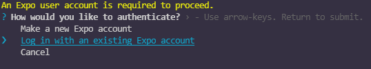
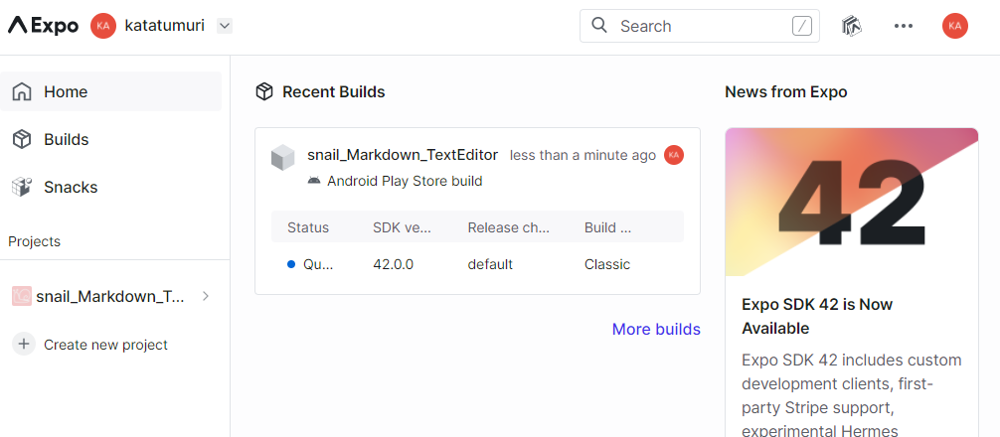
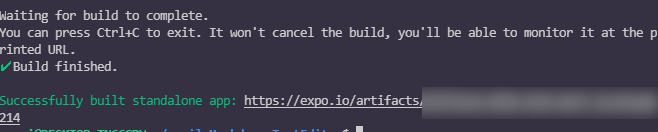

>------------<
- タイトル:[【18】React Nativeでテキストエディタを作ってみる！【デプロイ編】]
- WordPressにアップロードしますか？:y[]はいn[x]まだしない
- 投稿時:p[]公開d[x]下書き
- カスタムURL:[React-Native-challenge-to-create-text-editor-18]
- カテゴリID:[3,11,12]
- タグID:[]
- 見出し画像のID:[]
- 識別番号[5aLARpCAw4vL]
>------------<

<!-- ↓続き
[kanren id=""] -->

こんにちは！かたつむり([@Katatumuri_nyan](https://twitter.com/Katatumuri_nyan))です！

Reactを触ってみて、サイト的なものは作れるようになりました(*´ω｀)
そこで、次はReactNativeを触ってみようと思い、簡単なテキストエディタを作成しようと企んでおります(笑)

アプリの機能としては十分できてきたと思うので、これからビルド・デプロイ・公開申請をしていきます！

[GitHub](https://github.com/katatumuri-maimai/snail_Markdown_TextEditor)でソースコードを管理しています！

**最初から見る↓**
[kanren id="557"]

**前回を見る↓**
[kanren id="661"]


## 環境
- React Native
- Expo
- windows 10

## 参考
- [React Native + Expo - WindowsでアプリビルドからAppストア申請まで！【2020年3月時点】](https://tkd708.hatenablog.com/entry/react_native_expo_windows_from_build_to_app_store_application_2020)
- [Expo公式ドキュメント](https://docs.expo.dev/distribution/building-standalone-apps/)
こちらを参考に公開申請していきます。


## 公開申請用の設定 app.jsonの構成
まず、`app.json`に公開用の設定を書いていきます。[2.app.jsonを構成します](https://docs.expo.dev/distribution/building-standalone-apps/#2-configure-appjson)

既に、`app.json`はあるので、足りなさそうな部分を書き足しました。

```javascript
{
  "expo": {
    "name": "snail_Markdown_TextEditor",
    "slug": "snail_Markdown_TextEditor",
    "version": "1.0.0",
    "icon": "./assets/icon.png",
    "splash": {
      "image": "./assets/splash.png",
      "resizeMode": "contain",
      "backgroundColor": "#ffffff"
    },
    "updates": {
      "fallbackToCacheTimeout": 0
    },
    "assetBundlePatterns": [
      "**/*"
    ],
    "ios": {
+      "bundleIdentifier": "com.katatumuri.snailmarkdowntexteditor",
+      "buildNumber": "1.0.0",
      "supportsTablet": true,
      "usesIcloudStorage":true
    },
    "android": {
+      "package": "com.katatumuri.snailmarkdowntexteditor",
+      "versionCode": 1,
      "adaptiveIcon": {
        "foregroundImage": "./assets/adaptive-icon.png",
        "backgroundColor": "#FFFFFF"
      }
    },
    "web": {
      "favicon": "./assets/favicon.png"
    }
  }
}
```

## ビルド
ビルドしていくので、とりあえず `expo start`します。

### Andoroid用にビルド

> Android用にビルドすることを選択した場合
> expo build:android -t apkAndroid向けにビルドする場合、APK（）またはAndroid App Bundle（expo build:android -t app-bundle）のビルドを選択できます。アプリバンドルをお勧めしますが、プロジェクトでGoogle Playアプリ署名が有効になっていることを確認する必要があります。詳細については、こちらをご覧ください。
> プロジェクトを初めてビルドするときに、キーストアをアップロードするか、それともGoogleに処理してもらうかを尋ねられます。キーストアが何であるかわからない場合は、キーストアを生成してもらうことができます。それ以外の場合は、自由にアップロードしてください。
> Expoにキーストアを生成させることを選択した場合は、後で キーストアを実行して安全な場所にバックアップすることを強くお勧めしますexpo fetch:android:keystore。アプリをGooglePlayストアに送信したら、そのアプリに対する今後のすべての更新 は、Googleが受け入れるために、同じキーストアで署名する必要があります。何らかの理由で、将来プロジェクトを削除したり、資格情報をクリアしたりした場合、キーストアをバックアップしていないと、アプリに更新を送信できなくなります。

Expoの公式ドキュメント通りにやっていきます。
Google Playアプリ署名がわからないので、apkでやってみますｗ
別コンソールを開いて`expo build:android -t apk`

  

Expoのアカウントがあるので、
ログインします。
  

キーストアを作るか聞かれるので、作っておきます。

  
ビルド中、Expoのホームでこんな感じで表示されてました。

  
できたっぽい