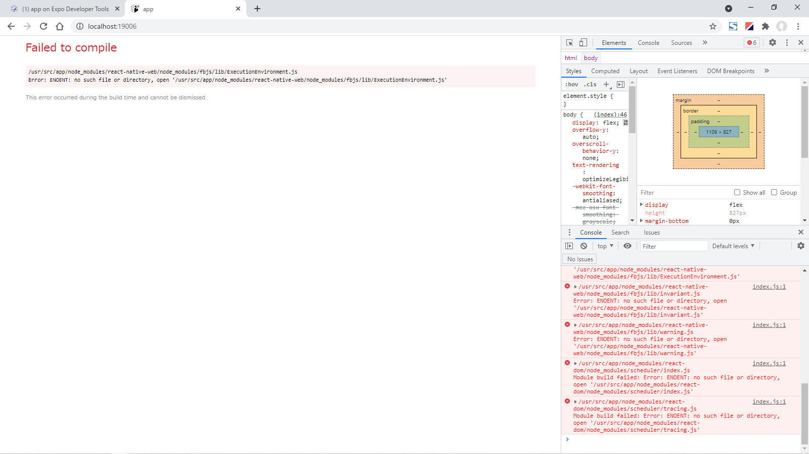
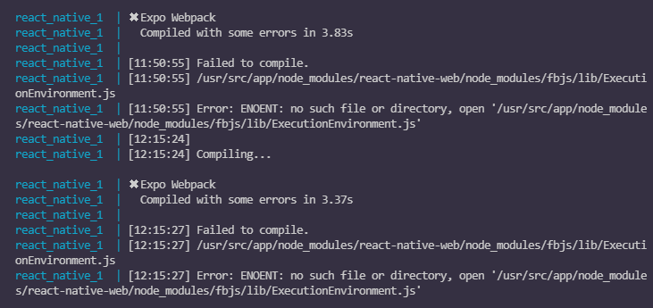
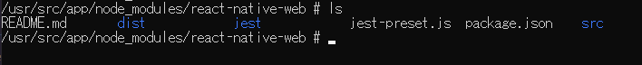
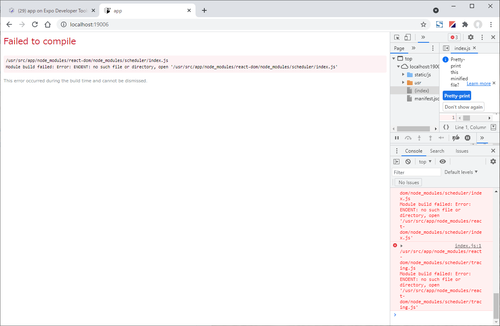
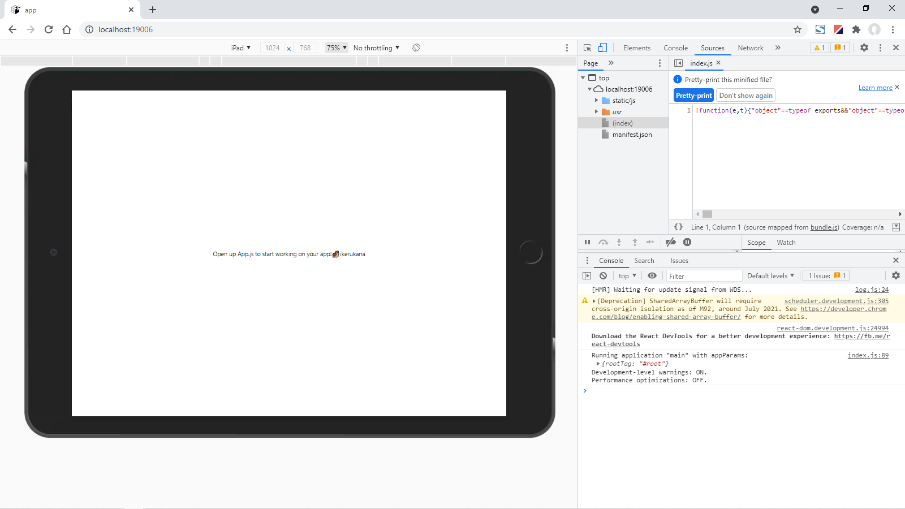
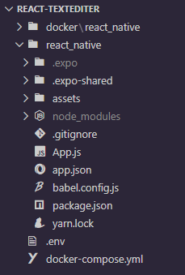
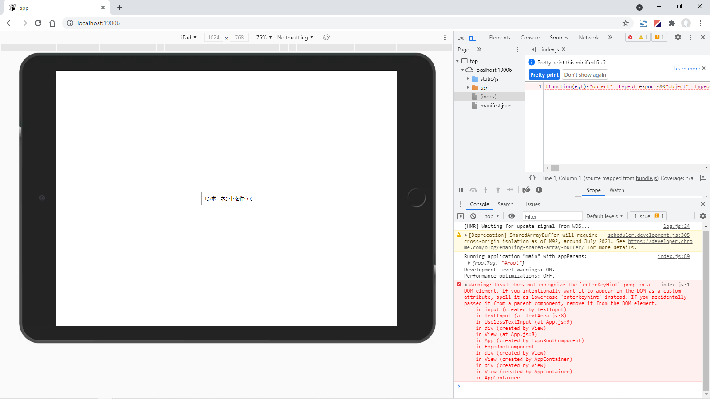

>------------<
- タイトル:[【3】React Nativeでテキストエディタを作ってみる！【テキストエリア作成編】]
- WordPressにアップロードしますか？:y[x]はいn[]まだしない
- 投稿時:p[]公開d[x]下書き
- カスタムURL:[React-Native-challenge-to-create-text-editor-3]
- カテゴリID:[3,11,12]
- タグID:[]
- 見出し画像のID:[]
- 識別番号[]
>------------<

こんにちは！かたつむり([@Katatumuri_nyan](https://twitter.com/Katatumuri_nyan))です！

Reactを触ってみて、サイト的なものは作れるようになりました(*´ω｀)
そこで、次はReactNativeを触ってみようと思い、簡単なテキストエディタを作成しようと企んでおります(笑)

環境構築があらかた終わったので、早速画面を作成してみたいと思います！


[GitHub](https://github.com/katatumuri-maimai/ReactNative-TextEditer)でソースコードを管理しています！

**最初から見る↓**
[kanren id="557"]

**前回を見る↓**
[kanren id="559"]


## いきなりエラーから始まります…
  

```
/usr/src/app/node_modules/react-native-web/node_modules/fbjs/lib/ExecutionEnvironment.js
Error: ENOENT: no such file or directory, open '/usr/src/app/node_modules/react-native-web/node_modules/fbjs/lib/ExecutionEnvironment.js'
```

これは前回の記事の最後に`expo upgrade`したせいですね…。
これ、`react-native-web`がインストールされてないってことかなぁ…。
と思い、確認するとありました。
でも
`/usr/src/app/node_modules/react-native-web/node_modules/fbjs/lib/ExecutionEnvironment.js`はないですね…。

  

よく見たら、`expo upgrade`のエラーが残っていました。
内容は同じっぽいですね。


  
↑一応コンテナ側で確認するも、確かに`/usr/src/app/node_modules/react-native-web/node_modules/fbjs/lib/ExecutionEnvironment.js`はない…。

`react-native-web`を入れなおしてみます。
`yarn add react-native-web`をしてインストール


  

```
/usr/src/app/node_modules/react-dom/node_modules/scheduler/index.js
Module build failed: Error: ENOENT: no such file or directory, open '/usr/src/app/node_modules/react-dom/node_modules/scheduler/index.js'
```

次はこれ↑

`yarn upgrade`もしてみたけど、とくに変わらないので、Docker imageからbuildしなおすことにしました。`expo`の初期化はなし。


## Google Chromeデベロッパーツールの拡張
やっと開発できるようになったので、デベロッパーツールでiPhoneとiPadの表示を確認しながらやっていきます。

  

こんなことができたので( ..)φメモメモ

三点マークを押して、`show device frame`で一部のデバイスのフレームが表示されました。

## 今のディレクトリ構成
  

`App.js`がおそらくメインの枠になるので、これに合わせてコンポーネントを作っていきます。

## テキストエリアを作成
そもそも、テキストエリアって、Inputエリアでいいのかな…？

とりあえず、`TextArea.js`を作成し、`App.js`に読み込んでみます。
素材は[公式リファレンス](https://docs.expo.io/versions/v41.0.0/react-native/textinput/)から。

```javascript
// App.js
import React from 'react';
import { StyleSheet, Text, View } from 'react-native';
import UselessTextInput from './components/TextArea';

export default function App() {
  return (
    <View style={styles.container}>
      <UselessTextInput
      value="Hello World!"
      />
    </View>
  );
}

const styles = StyleSheet.create({
  container: {
    flex: 1,
    backgroundColor: '#fff',
    alignItems: 'center',
    justifyContent: 'center',
  },
});
```

```javascript
// TextArea.js
import React, { Component } from 'react';
import { TextInput } from 'react-native';

export default function UselessTextInput(props) {
  const [value, onChangeText] = React.useState(props.value);

  return (
    <TextInput
      style={{ height: 40, borderColor: 'gray', borderWidth: 1 }}
      onChangeText={text => onChangeText(text)}
      value={value}
    />
  );
};
```

  

とりあえず、文字は打てるようになりました(*´ω｀)


## iPad向けに整形
[React Native Editor](https://www.npmjs.com/package/react-native-editor)

`npm i react-native-editor`してみる。
互換性があれば使いたい。


<!-- ↓続き
[kanren id=""] -->