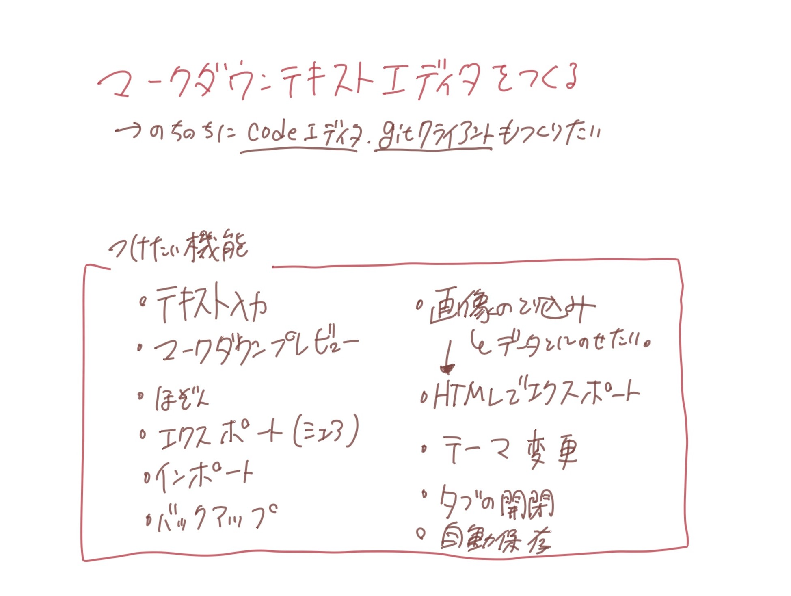
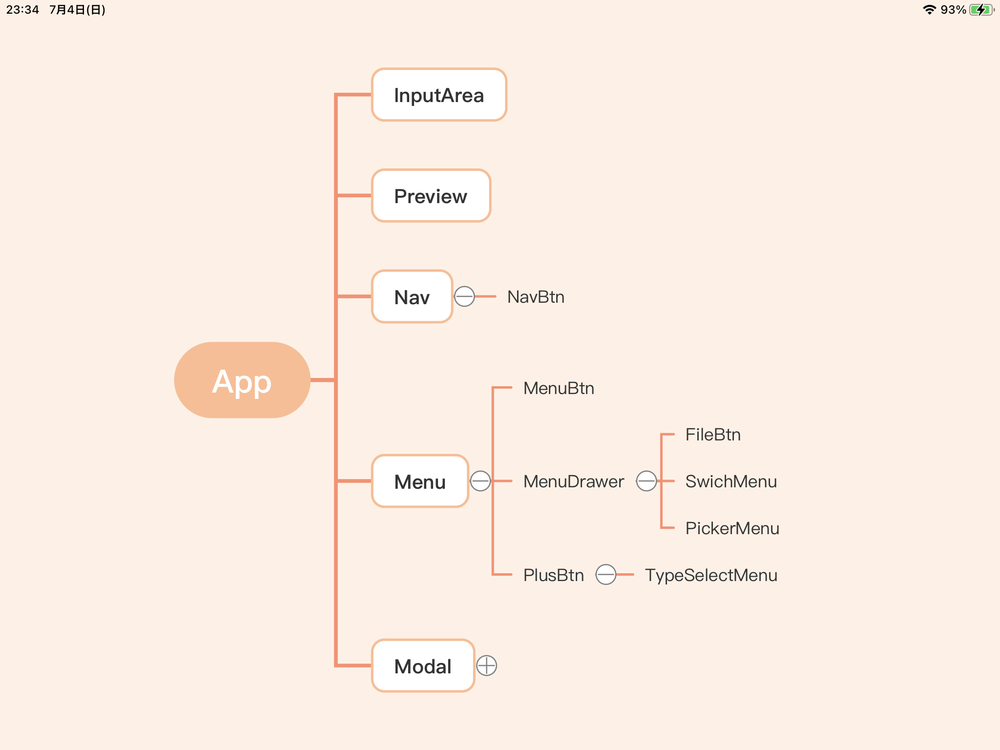
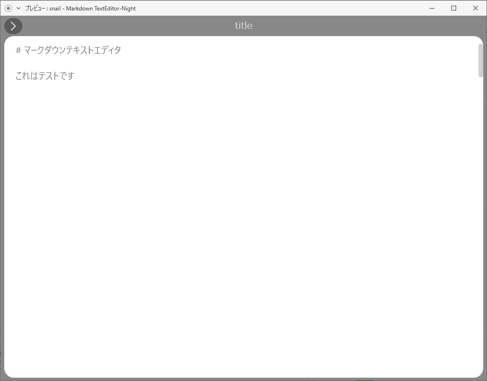
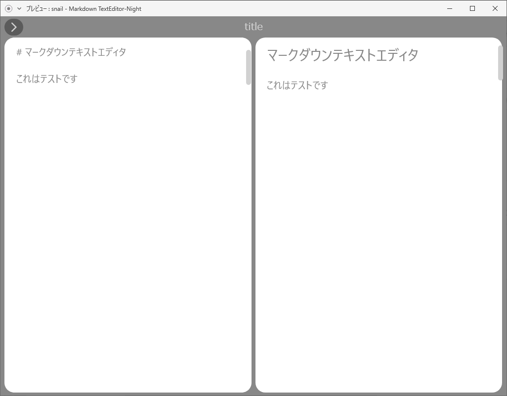
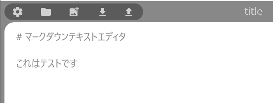
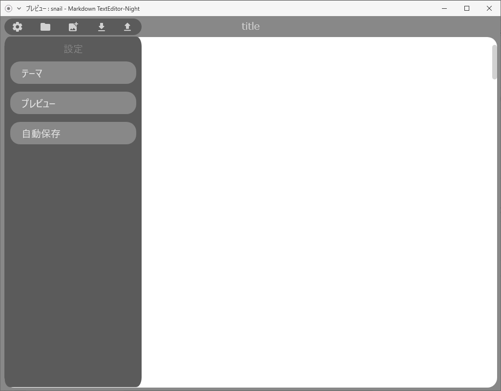

>------------<
- タイトル:[【8】React Nativeでテキストエディタを作ってみる！【再出発・デザイン編】]
- WordPressにアップロードしますか？:y[]はいn[x]まだしない
- 投稿時:p[]公開d[x]下書き
- カスタムURL:[React-Native-challenge-to-create-text-editor-8]
- カテゴリID:[3,11,12]
- タグID:[]
- 見出し画像のID:[]
- 識別番号[UaKgaRtkerDT]
>------------<

<!-- ↓続き
[kanren id=""] -->

こんにちは！かたつむり([@Katatumuri_nyan](https://twitter.com/Katatumuri_nyan))です！

Reactを触ってみて、サイト的なものは作れるようになりました(*´ω｀)
そこで、次はReactNativeを触ってみようと思い、簡単なテキストエディタを作成しようと企んでおります(笑)

前回までで、だいたいやりたいことができそうだと思ったので、デザインからやり直していきます！

<!-- [GitHub]()でソースコードを管理しています！ -->

**最初から見る↓**
[kanren id="557"]

**前回を見る↓**
[kanren id="608"]

## アプリ作成の計画
まずは、アプリの要件を考えていきます。(*´ω｀)
iPadのconceptというアプリを使って、手書きで書いていきました。
（紙でも何でもいいと思いますうう）

### アイデア出し
  

作りたいアプリの機能を適当に書き出してみます。
ざっくり書き出して、アイデアを固めていきました。

### デザインスケッチ
  

形から入るタイプなので←
デザインをスケッチしていきました。

デザインを考えながら、この機能はここで使うとか、この機能も必要だなとか考えています。

React Native+Expoでは、使えるライブラリが制限されているので、
ほしい機能に対してライブラリがあるか、もしくは自分で書けそうかを調べながらデザインをしていきました。

### コンポーネントの書き出し
  
必要そうなコンポーネントに名前をつけて書き出してみました。

作成している途中で変わるかもしれませんが、大枠はこんな感じでしょう。

## アプリデザイン
  

早速デザインを作りました！
使用したツールやデザインの詳細などを説明していきますね。

### 使用したツール
- [adobXD](https://www.adobe.com/jp/products/xd.html?sdid=19SCDRPN&mv=search&ef_id=CjwKCAjwuIWHBhBDEiwACXQYsc5KsJY2z-UKqr4C3iYddqYKHFgDkuBcTo623qFJ2_Hg-Ja1TmNhyBoCwP4QAvD_BwE:G:s&s_kwcid=AL!3085!3!380840905165!e!!g!!adobe%20xd!1641270158!61553403526) アプリのデザイン
- [COLOR TOOL](https://material.io/resources/color/#!/?view.left=0&view.right=0) カラーピッカー
- [Google Fonts Icons](https://fonts.google.com/icons)

## デザインの詳細を考える
デザインと機能の兼ね合いを考えながらデザインしていきました。
タブレットで使用する前提で考えていたので、横向きの画面メインで作成しています。

動きもつけてみて、イメージを固めました↓
<blockquote class="twitter-tweet">
テキストエディタアプリのデザインをadobeXDで作成してみました(*´ω｀) <a href="https://t.co/lmeVoQHy2e">pic.twitter.com/lmeVoQHy2e</a>
&mdash; Katatumuri (@Katatumuri_nyan) <a href="https://twitter.com/Katatumuri_nyan/status/1411919367244173312?ref_src=twsrc%5Etfw">July 5, 2021</a></blockquote> 
↑こんな感じで動く想定です！

### 1. 基本のエディターデザイン(InputArea)
  
[adobXD](https://www.adobe.com/jp/products/xd.html?sdid=19SCDRPN&mv=search&ef_id=CjwKCAjwuIWHBhBDEiwACXQYsc5KsJY2z-UKqr4C3iYddqYKHFgDkuBcTo623qFJ2_Hg-Ja1TmNhyBoCwP4QAvD_BwE:G:s&s_kwcid=AL!3085!3!380840905165!e!!g!!adobe%20xd!1641270158!61553403526)にて、デザインを作成していきます。
シンプルで見やすくしたかったので、エディター部分を大きくしました。
スクロールができる想定なのと、キーボードが物理かどうか判断してサイズが変わるようにしたいです。

### 2. プレビューのデザイン(Preview)
  

プレビューを見ながら書きたいので（自分が）
右から左にスワイプすると、右からプレビューコンポーネントが出てくるようにします。

### 3. ナビのデザイン(Nav)
  
左上にナビを開くボタンがあって、そこを押すとこのようにナビが開くようにしたい。

左にスワイプすると、閉じるはず。

- 設定
- エクスプローラー
- 画像追加（仮）
- インポート
- エクスポート

この5つのボタン(NavBtn)を設置します。
ボタンは、[Google Fonts Icons](https://fonts.google.com/icons)からお借りしました。

### 4. メニューのデザイン(Menu)
  
ナビのボタンを押すと、メニューが左から右にスライドして開くようにします。
画像にはないですが、メニューのボタン(MenuBtnなど)を押した場合の挙動なども考えました。

### 5. モーダル(Modal)
React Nativeで基本のコンポーネントがあるので、それを使います。

## テーマカラーを選ぶ
テーマを変えれるようにしたいので、いくつかテーマを作成しました。
  

[COLOR TOOL](https://material.io/resources/color/#!/?view.left=0&view.right=0)でカラーを選んだり、自分で微調整しながら決めました。

必要なカラーの数を考えました。

- メイン背景色
- セカンド背景色
- インプット文字色
- プレビュー文字色
  …など

  これにそって、テーマカラーの変数を定義して行こうと思います✨

  ちなみに、自分用のカラーは右下のやつですｗ
  `DarkRed`って名前になりました。
  
  次の記事では実際に、アプリを作っていきます！

  まずは、アプリの見た目を作成していきます(*´ω｀)
