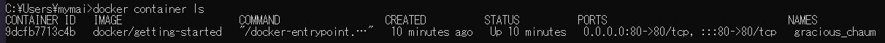
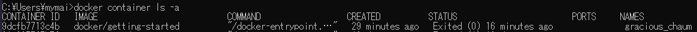
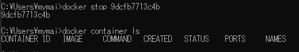
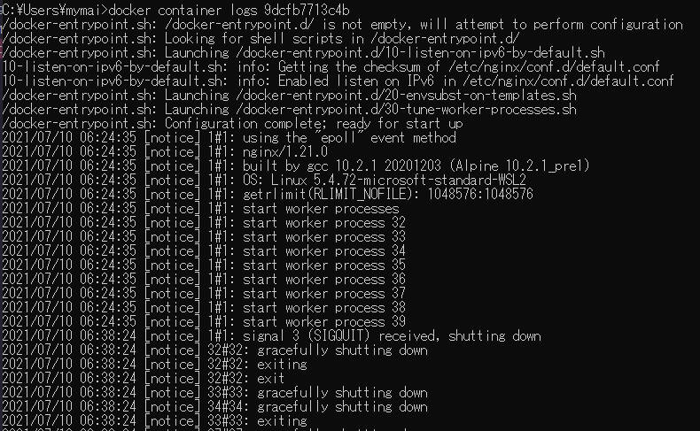

ハンズオンでDockerを使用したので、メモを書いていきます(^▽^)/

## Dockerの基本操作
はじめは、Dockerの起動から、コマンドラインでのDockerの操作を学びました。

### お作法！`docker run -d -p 80:80 docker/getting-started`
最初にするお作法。
コマンドの説明をしていただきました。

#### `docker run <指定>`
指定したコマンドを実行する

#### `docker/getting-started`
`docker/getting-started`というイメージを起動。
ない場合はダウンロード
※土台のコンテナの様なもの

#### `-d`
バックグラウンドで。
立ち上がるまでコマンドが打てないのを回避。

#### `-p`
ポート設定
ポートをつなげる
左がHOST、右がコンテナのポート

### 起動しているコンテナの確認`docker container ls`
  

### すべてのコンテナの確認`docker container ls -a`
  

`-a`は`all`

### コンテナの停止`docker stop <コンテナID>`
  

### メタ情報確認`docker container logs <コンテナID>`
  
Dockerのログが確認できます。

### コンテナの削除`docker rm <ID>`
### すべてのコンテナの削除`docker system prune -a`
`prune`刈り取る
停止中のコンテナがあると、処理スピードは変わらないかもしれないけど、容量を食うので、たまに全消ししたほうが良い
ログの出力がたくさんあったりする。

## その他メモ
情報共有に便利な[HackMD](https://hackmd.io/)
おすすめホラー映画[HOUSE (ハウス)](https://www.amazon.co.jp/HOUSE-%E3%83%8F%E3%82%A6%E3%82%B9-%E6%B1%A0%E4%B8%8A%E5%AD%A3%E5%AE%9F%E5%AD%90/dp/B00FIWA60E)

## 疑問
- お作法！`docker run -d -p 80:80 docker/getting-started`を打ったことがないけどいいのかなぁ
- docker-compose使ってるけど、普通は使うのかなぁ